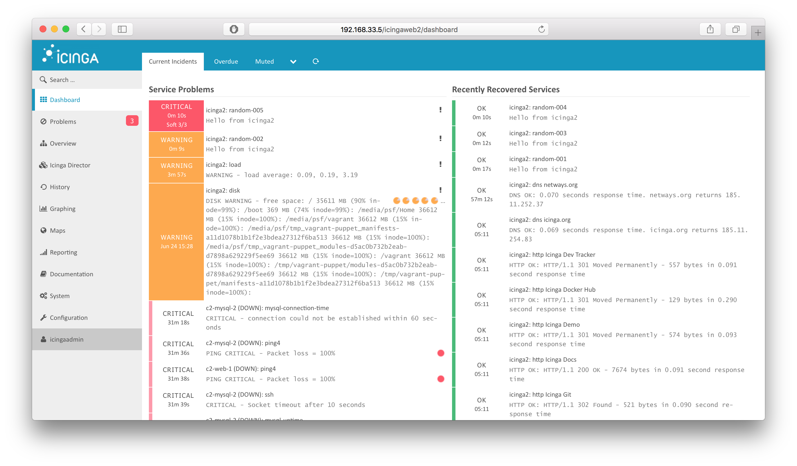
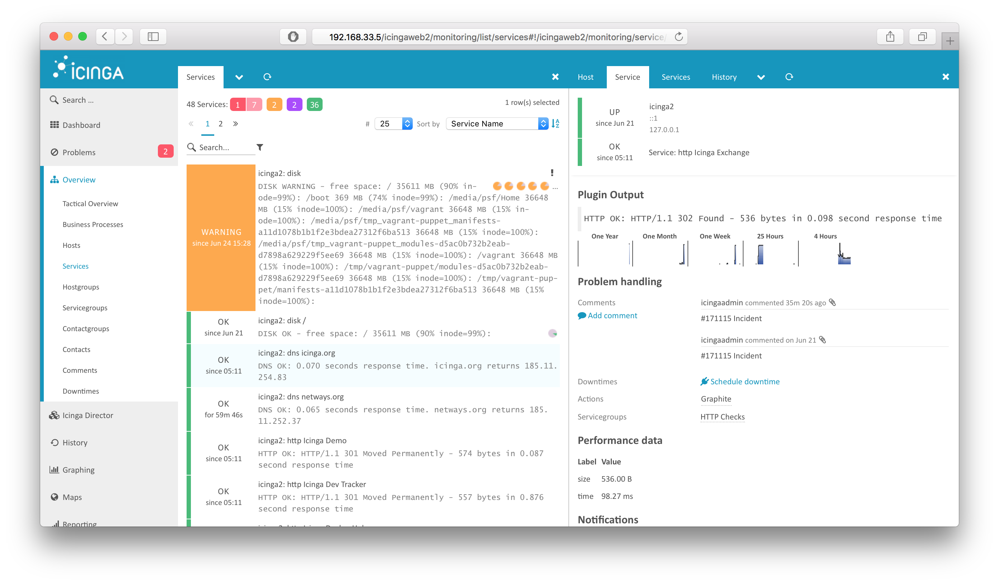
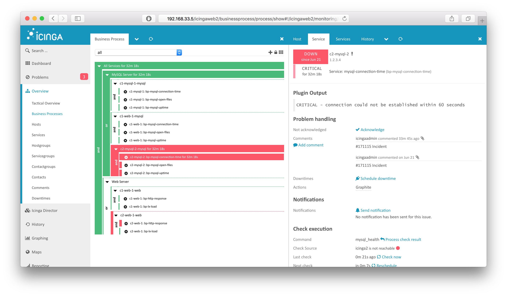
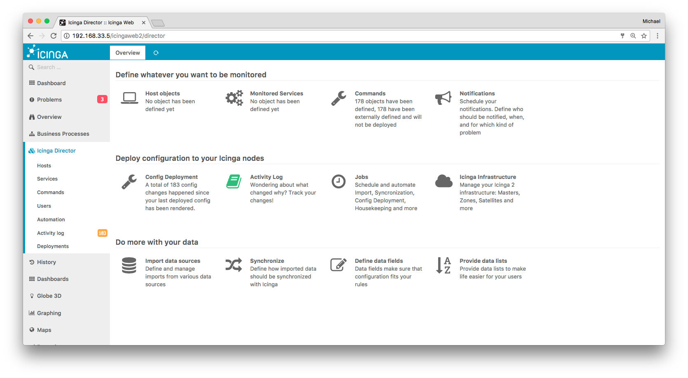
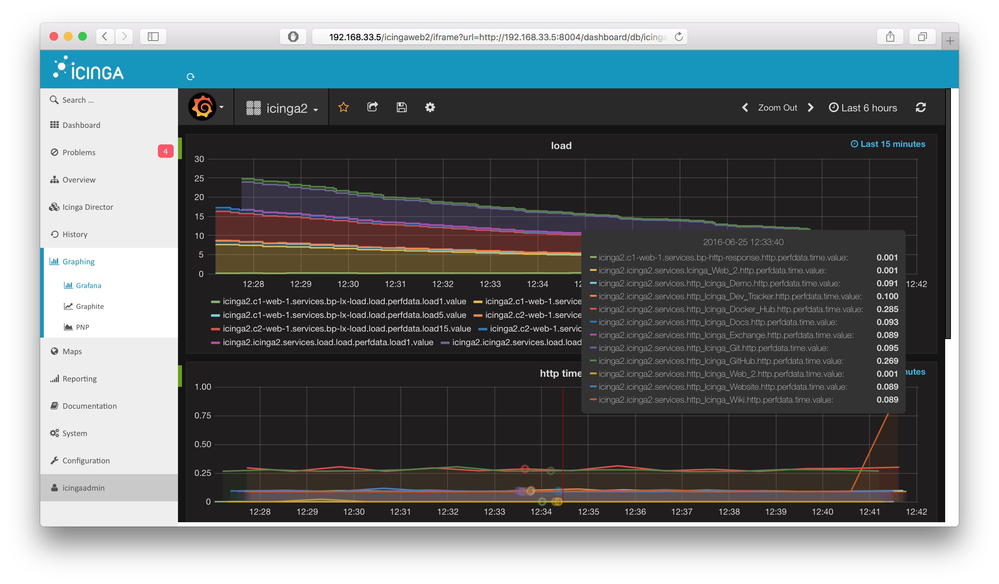
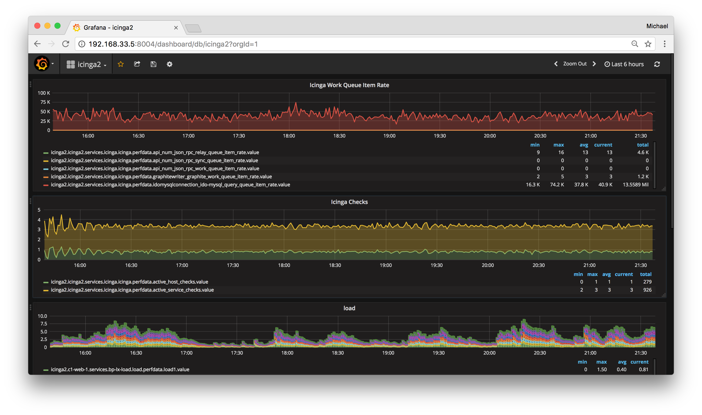
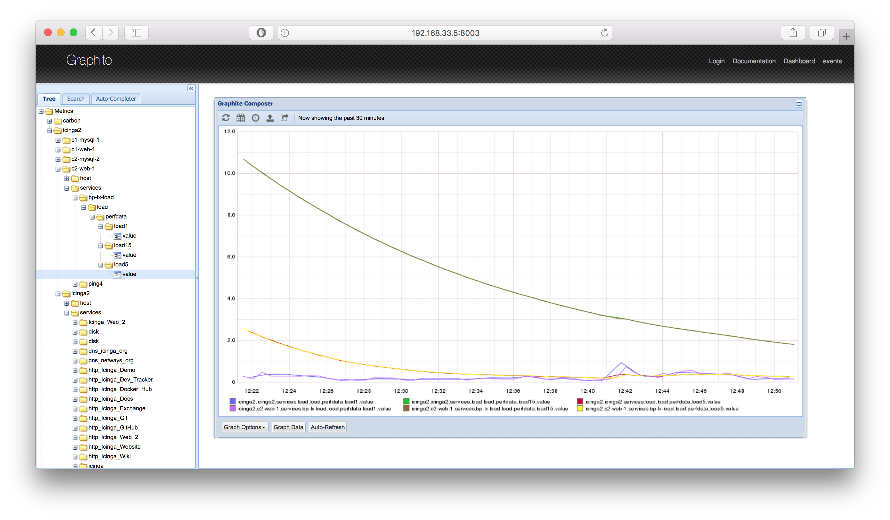
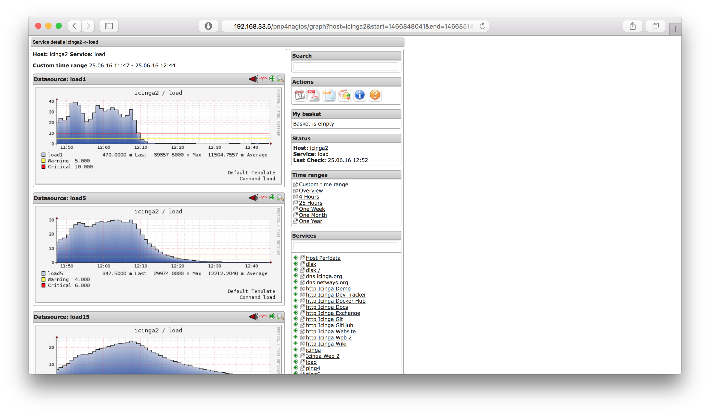
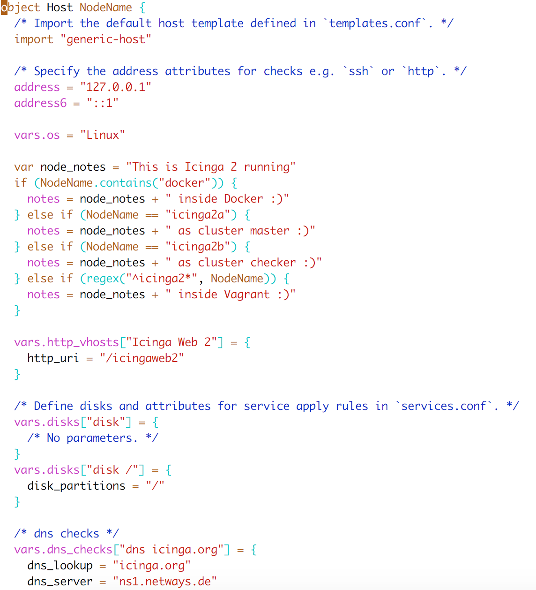

# Icinga Vagrant Boxes

Icinga Vagrant boxes used for development, tests and demo cases.

* [Icinga 2 Standalone](README.md#icinga2x)
* [Icinga 2 Cluster](README.md#icinga2x-cluster)
* [Icinga 2 and Graylog](README.md#icinga2x-graylog)
* [Icinga 1.x](README.md#icinga1x)

## Screenshots

## Requirements

Each Vagrant box setup requires at least 2 Cores and 1 GB RAM.
The required resources are automatically configured during the
`vagrant up` run.

* Vagrant >= 1.6.5 from http://www.vagrantup.com

One of these virtualization providers:

* Virtualbox >= 4.2.16 from http://www.virtualbox.org
* Parallels Desktop Pro/Business >= 11 from http://www.parallels.com/products/desktop/

### Windows

In addition the listed requirements you'll need:

* SSH provided by the Git package from http://msysgit.github.io
* Ruby for Windows from http://rubyinstaller.org (add Ruby executables to PATH)

Install the Git package and set `autocrlf` to `false` (either in the setup
dialog or using the cmd shell):

    git config core.autocrlf false

Then clone this repository:

    git clone https://github.com/Icinga/icinga-vagrant

### Virtualbox Provider

If Virtualbox is installed, this will be enabled by default.

### Parallels Provider

You'll need to install the [vagrant-parallels](http://parallels.github.io/vagrant-parallels/docs/)
plugin first:

    $ vagrant plugin install vagrant-parallels

## Support

Please note that these boxes are built for development and tests only. Productive
setups are not supported.

In case you've found a problem or want to submit a patch, please open an issue
at [dev.icinga.org](https://dev.icinga.org/projects/icinga-tools/issues).

## Before you start

Change the directory to the box you want to start.

Example icinga2x:

    $ cd icinga2x

You can only do `vagrant up` in a box directory. Verify that
by checking for the existance of the `Vagrantfile` file in the current
directory.

    $ pwd
    /home/michi/coding/icinga/icinga-vagrant/icinga2x
    $ ls -la Vagrantfile
    -rw-------. 1 michi michi 1,4K 28. Aug 12:11 Vagrantfile

### Vagrant Commands

* `vagrant up` starts all vms for this box setup
* `vagrant halt` stops all vms for this box setup
* `vagrant provision` updates packages/resets configuration for all vms
* `vagrant ssh` puts you into an ssh shell with login `vagrant` (**Tip**: Use `sudo -i` to become `root`)

> **Note**
>
> Multi-VM boxes require the hostname for `vagrant ssh` like so: `vagrant ssh icinga2b`.
> That works in a similar fashion for other sub commands.

If your box is broken, you can destroy it using `vagrant destroy`. Next `vagrant up`
run will use the already imported base box, re-running the provisioner to install
the packages and configuration.

### More Usability Hints

Follow the instructions described in the `README.md` file
for each box.

Choose one of the available boxes below.

## Icinga 2 Standalone

* 1 VM
* Icinga 2 Core
  * Icinga 2 API
* Icinga Web 2
 * Icinga [Director](https://github.com/Icinga/icingaweb2-module-director)
 * [PNP](https://github.com/Icinga/icingaweb2-module-pnp) module
 * [Graphite](https://github.com/Icinga/icingaweb2-module-graphite) module
 * [Business Process](https://github.com/Icinga/icingaweb2-module-businessprocess) module
 * [Generic TTS](https://github.com/Icinga/icingaweb2-module-generictts) module
 * [NagVis](https://github.com/Icinga/icingaweb2-module-nagvis) module
* PNP4Nagios
* NagVis
* Graphite
* Grafana 2
* Dashing

Run Vagrant:

    $ cd icinga2x && vagrant up

### User Interfaces

  GUI               | Url                               | Credentials
  ------------------|-----------------------------------|----------------
  Icinga Web 2      | http://192.168.33.5/icingaweb2    | icingaadmin/icinga
  PNP4Nagios        | http://192.168.33.5/pnp4nagios    | -
  Graphite Web	    | http://192.168.33.5:8003          | -
  Grafana 2         | http://192.168.33.5:8004          | admin/admin
  Dashing           | http://192.168.33.5:8005          | -

Note: In case Dashing is not running, restart it manually:

    $ vagrant ssh -c "sudo /usr/share/dashing-icinga2/restart-dashing -p 8005 -D /usr/share/dashing-icinga2 -b /usr/local/bin/dashing"

### Icinga 2 API

Access [https://192.168.33.5:5665/v1/objects/hosts](https://192.168.33.5:5665/v1/objects/hosts)
using the credentials `root/icinga`. More details in the [documentation](http://docs.icinga.org/icinga2/snapshot/doc/module/icinga2/chapter/icinga2-api#icinga2-api).

## Icinga 2 Cluster

* 2 VMs as Icinga 2 Master/Checker Cluster
* Icinga 2 Core, DB IDO MySQL, Icinga Web 2

Run Vagrant:

    $ cd icinga2x-cluster && vagrant up

### User Interfaces

  GUI               | Url                                   | Credentials
  ------------------|---------------------------------------|----------------
  Icinga Web 2      | http://192.168.33.10/icingaweb2       | icingaadmin/icinga
  Icinga Web 2      | http://192.168.33.20/icingaweb2       | icingaadmin/icinga

### Icinga 2 API

Access [https://192.168.33.10:5665/v1/objects/hosts](https://192.168.33.10:5665/v1/objects/hosts)
and [https://192.168.33.20:5665/v1/objects/hosts](https://192.168.33.20:5665/v1/objects/hosts)
using the credentials `root/icinga`.

## Icinga 2 and Graylog

* 1 VM
* Icinga 2 Core
* Graylog Server and Web with Elasticsearch, MongoDB

Run Vagrant:

    $ cd icinga2x-graylog && vagrant up

### User Interfaces

  GUI              | Url                             | Credentials
  -----------------|---------------------------------|------------------------
  Icinga Web 2     | http://192.168.33.6/icingaweb2  | icingaadmin/icinga
  Graylog          | http://192.168.33.6:9000        | admin/admin

## Icinga 1.x

* 1 VM
* Icinga 1.x Core, IDOUtils MySQL, Classic UI, Web

Run Vagrant:

    $ cd icinga1x && vagrant up

### User Interfaces

http://localhost:8081 shows an entry page including all urls and
credentials.

  GUI               | Url                   | Credentials
  ------------------|-----------------------|----------------
  Icinga Classic UI | :8081/icinga          | icingaadmin/icingaadmin
  Icinga Web 1.x    | :8081/icinga-web	    | root/password
  Jasperserver	    | :8082/jasperserver    | jasperadmin/jasperadmin

## Misc

### Port Forwarding Overview

  Box Name          | VM Name   | Host Port | Guest Port
  ------------------|-----------|-----------|-----------
  icinga1x          | icinga1x  | 2081      | 22
  icinga1x          | icinga1x  | 8081      | 80
  icinga1x          | icinga1x  | 8082      | 8080
  icinga2x          | icinga2   | 2082      | 22
  icinga2x          | icinga2   | 8082      | 80
  icinga2x-cluster  | icinga2a  | 2085      | 22
  icinga2x-cluster  | icinga2a  | 8085      | 80
  icinga2x-cluster  | icinga2b  | 2086      | 22
  icinga2x-cluster  | icinga2b  | 8086      | 80
  icinga2x-graylog  | i2g2	| 2110      | 22
  icinga2x-graylog  | i2g2	| 8110      | 80
  icinga2x-graylog  | i2g2	| 9000      | 9000
  icinga2x-graylog  | i2g2	| 12201     | 12201 (tcp/udp)
  icinga2x-graylog  | i2g2	| 12900     | 12900

### Puppet Module Overview

These boxes use these imported puppet modules for provisioning:

  Name     		| Path				| Url
  ----------------------|-------------------------------|-------------------------------
  puppetlabs-stdlib	| modules/stdlib		| https://github.com/puppetlabs/puppetlabs-stdlib.git
  puppetlabs-concat	| modules/concat		| https://github.com/puppetlabs/puppetlabs-concat.git
  puppetlabs-apache	| modules/apache		| https://github.com/puppetlabs/puppetlabs-apache.git
  puppetlabs-mysql	| modules/mysql			| https://github.com/puppetlabs/puppetlabs-mysql.git
  puppetlabs-postgresql	| modules/postgresql		| https://github.com/puppetlabs/puppetlabs-postgresql.git
  puppetlabs-vcsrepo	| modules/vcsrepo		| https://github.com/puppetlabs/puppetlabs-vcsrepo.git
  puppet-module-epel	| modules/epel			| https://github.com/stahnma/puppet-module-epel.git
  puppet-php		| modules/php			| https://github.com/thias/puppet-php.git
  puppet-selinux	| modules/selinux		| https://github.com/jfryman/puppet-selinux.git
  graylog2-puppet	| modules/graylog2		| https://github.com/Graylog2/graylog2-puppet.git
  puppet-elasticsearch	| modules/elasticsearch		| https://github.com/elasticsearch/puppet-elasticsearch.git
  puppetlabs-mongodb	| modules/mongodb		| https://github.com/puppetlabs/puppetlabs-mongodb.git
  puppetlabs-java	| modules/java			| https://github.com/puppetlabs/puppetlabs-java.git
  puppet-yum		| modules/yum			| https://github.com/CERIT-SC/puppet-yum.git
  puppet-graphite	| modules/graphite		| Patched for systemd usage from https://github.com/echocat/puppet-graphite.git
  puppet-grafana	| modules/grafana		| https://github.com/bfraser/puppet-grafana.git
  puppet-wget           | modules/wget                  | https://github.com/maestrodev/puppet-wget.git
  puppet-vim            | modules/vim                   | https://github.com/saz/puppet-vim.git

#### Puppet Module Setup

**Notes for developers only.**

    $ git subtree add --prefix modules/vim https://github.com/saz/puppet-vim master --squash

