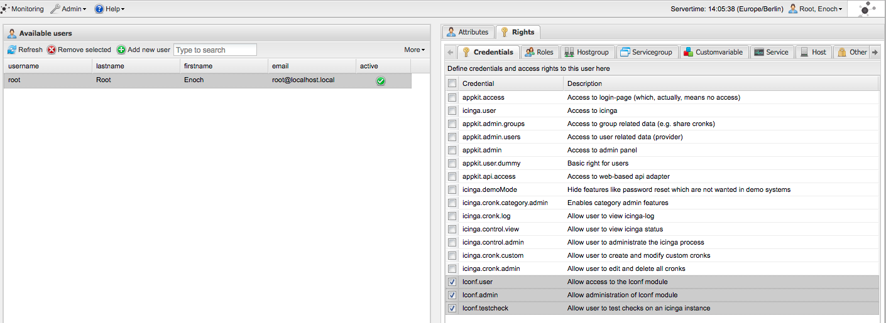
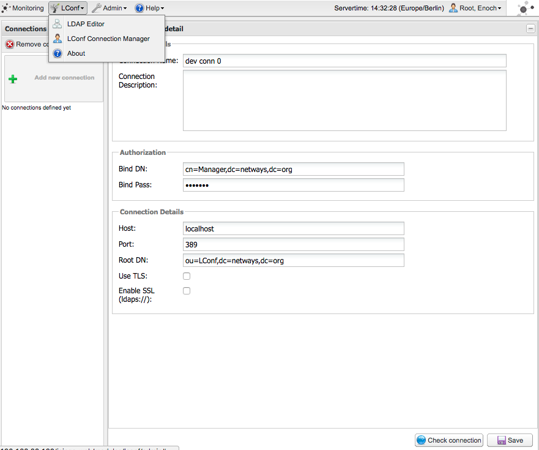
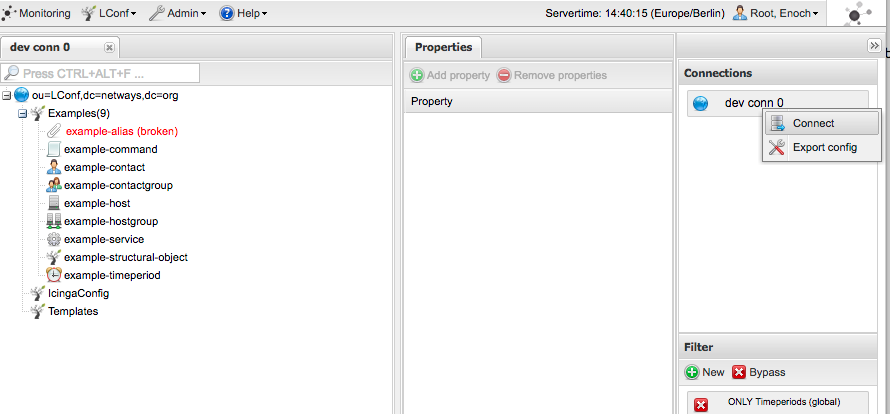

# About

Development box for Icinga 1.x and Icinga Web 1.x.

# Developer's Hints

    ssh -A vagrant@192.168.33.190
    git config --global user.name "Michael Friedrich"
    git config --global user.email "michael.friedrich@icinga.com"

## Icinga Core 1.x

    ssh -A vagrant@192.168.33.190
    git clone git@github.com:Icinga/icinga-core.git

    cd icinga-core
    make distclean
    ./configure --with-init-dir=/etc/init.d --with-plugin-dir=/usr/lib64/nagios/plugins --with-command-group=icingacmd
    make all
    sudo make fullinstall
    sudo make install-config

    sudo systemctl restart httpd

    /etc/init.d/icinga restart

Specific CGI changes:

    make cgis
    sudo make install-cgis

### IDOUtils

    sudo mysql -e "CREATE DATABASE icinga;"
    sudo mysql -e "GRANT ALL ON icinga.* TO 'icinga'@'localhost' IDENTIFIED BY 'icinga';"
    sudo mysql icinga < /home/vagrant/icinga-core/module/idoutils/db/mysql/mysql.sql

    mv /usr/local/icinga/etc/idomod.cfg-sample /usr/local/icinga/etc/idomod.cfg
    mv /usr/local/icinga/etc/ido2db.cfg-sample /usr/local/icinga/etc/ido2db.cfg

    mv /usr/local/icinga/etc/modules/idoutils.cfg-sample /usr/local/icinga/etc/modules/idoutils.cfg

    /etc/init.d/icinga restart

http://192.168.33.190/icinga - icingaadmin/icingaadmin

### Docs

    make create-docs

## Icinga Web 1.x

```
ssh -A vagrant@192.168.33.190
git clone git@github.com:Icinga/icinga-web.git
cd icinga-web

./configure
sudo make install install-apache-config
cd ..

sudo mysql -e "CREATE DATABASE icinga_web;"
sudo mysql -e "GRANT ALL ON icinga_web.* TO 'icinga_web'@'localhost' IDENTIFIED BY 'icinga_web';"
sudo mysql icinga_web < /home/vagrant/icinga-web/etc/schema/mysql.sql

sudo systemctl restart httpd
```

http://192.168.33.190/icinga-web - root/password


### LConf for Icinga Web 1.x

Passwords used default to `netways`

Backend:

```
sudo -i

yum -y install openldap-servers openldap-clients perl-LDAP rsync

systemctl start slapd
cd /etc/openldap/slapd.d/cn=config

sed -e 's/dc=my-domain,dc=com/dc=netways,dc=org/g' olcDatabase\=\{2\}hdb.ldif -i
sed -e 's/,dc=my-domain,dc=com/,dc=netways,dc=org/g' olcDatabase\=\{1\}monitor.ldif -i


slappasswd

New password:
Re-enter new password:
{SSHA}HJ+LyxBgqG53FGetFwgTA35MZGQ99VjM

vim olcDatabase\=\{2\}hdb.ldif

olcRootPW: {SSHA}HJ+LyxBgqG53FGetFwgTA35MZGQ99VjM

vim olcDatabase\=\{0\}config.ldif

olcRootPW: {SSHA}HJ+LyxBgqG53FGetFwgTA35MZGQ99VjM

systemctl restart slapd

cat << "EOF" > /tmp/ldap_initialize
dn: dc=netways,dc=org
objectClass: dcObject
objectClass: organization
dc: netways
o: netways
EOF

ldapadd -h 127.0.0.1 -x -D "cn=Manager,dc=netways,dc=org" -W -f /tmp/ldap_initialize

systemctl enable slapd

exit
```

```
git clone git@git.netways.org:lconf/lconf.git
cd lconf

./configure --with-lconf-cli-user=icinga --with-lconf-cli-group=icinga --with-ldap-dn="dc=netways,dc=org" --with-ldap-bind-dn="cn=Manager,dc=netways,dc=org" --with-ldap-bind-password=netways
make
sudo make install

sudo ldapadd -Y EXTERNAL -H ldapi:/// -f src/netways.schema.ldif
sudo ldapadd -h 127.0.0.1 -x -D "cn=Manager,dc=netways,dc=org" -W -f src/base.ldif

cd ..
```

Cronk:

```
git clone git@git.netways.org:lconf/icinga-module.git
cd icinga-module
./configure
sudo make install
sudo mysql icinga_web < etc/sql/lconf_icinga_web_mysql.sq
sudo mysql icinga_web < etc/sql/credentials.sql

cd ..
```

Navigate to http://192.168.33.190/icinga-web/ and go to `Admin->Users->select user->Rights->Credentials`.



Save, logout and login again.

Choose `LConf - Connection Manager`.

- BindDN: `cn=Manager,dc=netways,dc=org`
- BindPW: `netways`
- RootDN: `ou=LConf,dc=netways,dc=org`



Test the connection and save it.




# Releases

## Icinga 1.x

Versions:

    ./update-version 1.14.0

Docs:

    ./configure && make create-docs

Changelog:

    vim Changelog

## Icinga Web 1.x

Versions:

    vim etc/make/version.m4
    autoconf
    vim doc/VERSION
    vim icinga-web.spec

Changelog:

    vim doc/CHANGELOG-1.14
